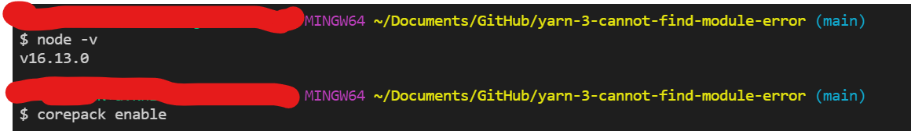
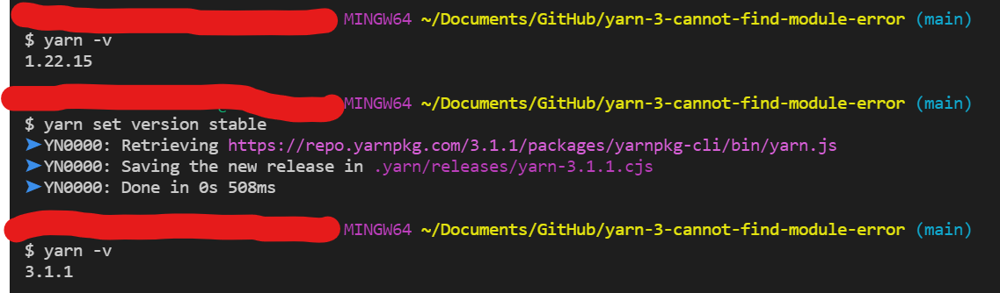
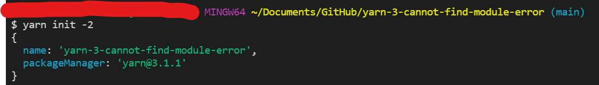
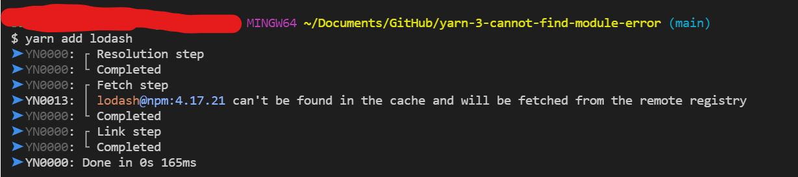
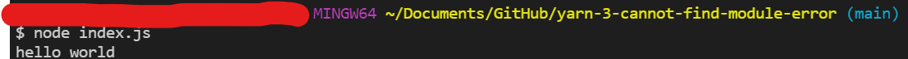
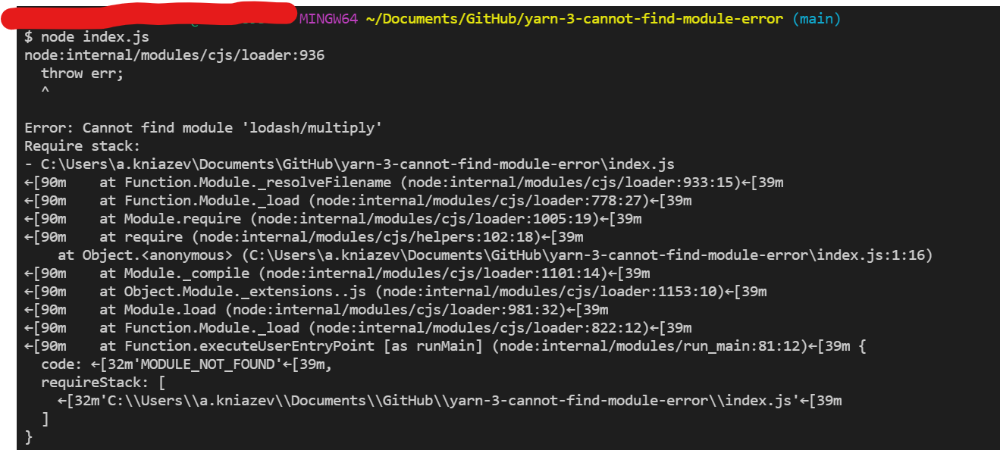

I will do step by step installation of yarn from here  https://yarnpkg.com/getting-started/install

# Step 1 Install Corepack

# Step 2 Initializing your project

# Step 3 Install Lodash

# Step 4 Run hello world

# Step 5 Use lodash - ERROR

